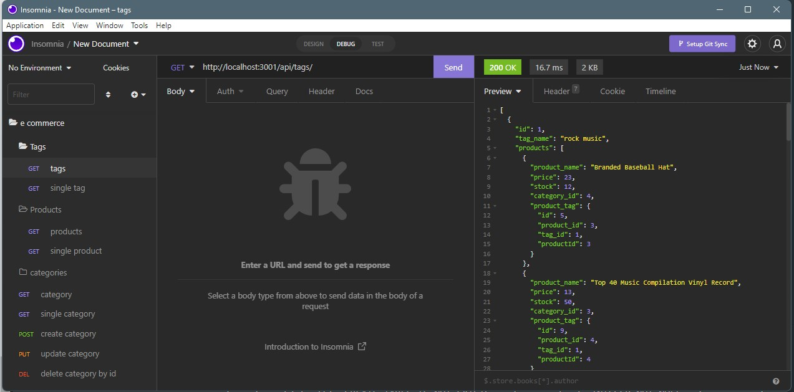
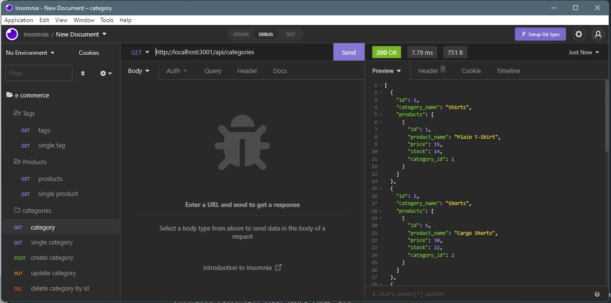
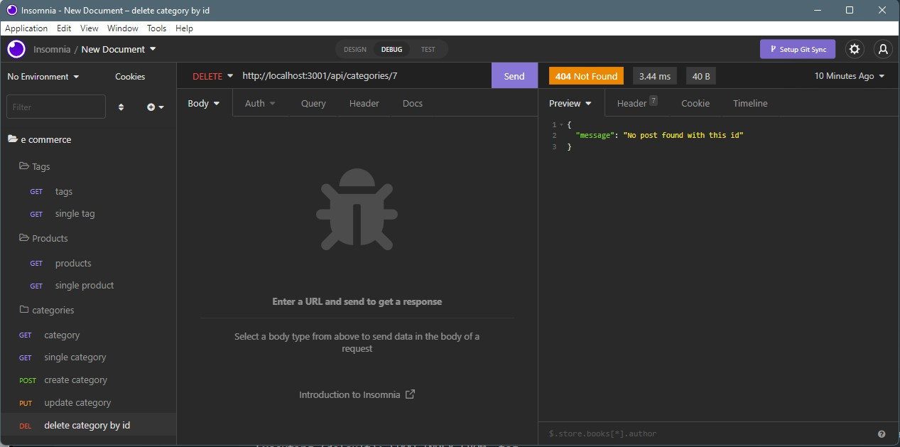

# E-commerce Back End(ORM) Project
## Description:
<blockquote>

Build the back end for an e-commerce site with express.js API and configure it to use Sequalize to interact with a MySQL database.

[Walktrough example](https://drive.google.com/file/d/1apTdqrCFP6vcfXGbBGnLkrvjHSp4vzT3/view?usp=sharing)

</blockquote>
  

## Table of Contents
- [Description](#description)
- [Instructions](#instructions)
- [Contributions](#contributors)
- [Images](#images)
- [Contact](#questions)
- [license](#license)

## Instructions:

You will need to run a "npm i" for the node packages, use MySQL to source the schema file. Use "npm run seed" to seed the database. Check routes with insomia.

  
## Contributors:

Ambrose Shokunbi, Rice Bootcamp

  

## Images:

  

## Questions:
[Github](https://github.com/ashokunb)
 
Email: shokunbitobi@gmail.com

## License:

  This application is covered under the  license
 
